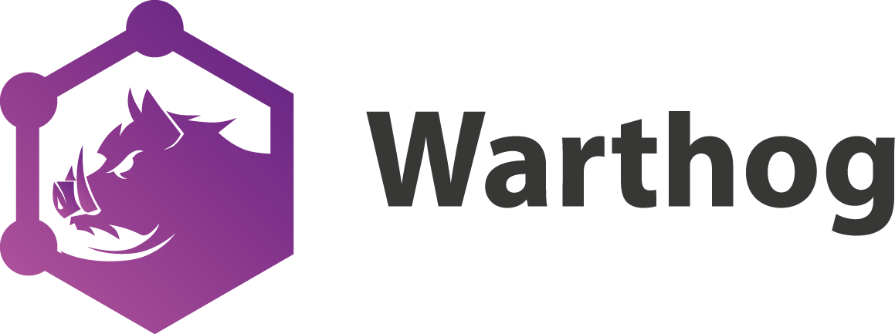

<p align="center">
  <a href="http://warthog.dev/"></a>
</p>

 <p align="center">
   Node.js <a href="https://graphql.org" target="_blank">GraphQL</a> Framework for building APIs with strong conventions through auto-generated code.  With Warthog, set up your data models and resolvers, and it does the rest.
</p>

<p align="center">
  <a href="https://www.npmjs.org/package/warthog"></a>
  <a href="https://circleci.com/gh/goldcaddy77/warthog/tree/master"></a>
  <a href="https://codecov.io/gh/goldcaddy77/warthog"></a>
  <a href="#badge"></a>
  <a href="https://github.com/semantic-release/semantic-release"></a>
  <a href="https://gitter.im/warthog-graphql/community?utm_source=badge&amp;utm_medium=badge&amp;utm_campaign=pr-badge&amp;utm_content=badge"></a>
</p>

## Summary

Warthog is a [Node.js](http://nodejs.org) GraphQL API framework for quickly building consistent GraphQL APIs that have sorting, filtering and pagination out of the box.  It is written in [TypeScript](http://www.typescriptlang.org) and makes heavy use of decorators for concise, declaritive code.

## Philosophy

This library is intentionally opinionated and generates as much code as possible.  When teams build products quickly, even if they have strong conventions and good linters, the GraphQL can quickly become inconsistent, making it difficult for clients to consume the APIs in a reusable way.

To do this, Warthog automatically generates the following:

- Database schema - generated by [TypeORM](https://github.com/typeorm/typeorm)
- Your entire GraphQL Schema including:
  - types to match your entities - generated by [TypeGraphQL](https://github.com/19majkel94/type-graphql)
  - GraphQL inputs for consistent creates, updates, filtering, and pagination
    inspired by [Prisma](https://github.com/prisma/prisma)'s conventions
- A [graphql-binding](https://github.com/graphql-binding/graphql-binding) for
  type-safe programmatic access to your APIs.
- TypeScript classes for the generated GraphQL schema for type-safety while developing.

Further, it covers the following concerns by hooking into best-in-class open source libraries:

- Validation: Automatic validation before data is saved using any of the decorators available in the [class-validator](https://github.com/typestack/class-validator#validation-decorators) library.

## Prerequisites

You must have Postgresql installed to use Warthog.  If you already have it installed, you can skip this step, otherwise there are 3 options:

### Docker

See the [warthog-starter](https://github.com/goldcaddy77/warthog-starter/pull/6/files) project for how to use Docker to run Postgres.

### Homebrew

If you're on OSX and have [Homebrew](https://brew.sh/) installed, you can simply run:

```bash
brew install postgresql
`brew --prefix`/opt/postgres/bin/createuser -s postgres
```

### Postgres.app

Otherwise, you can install [Postgres.app](https://postgresapp.com/) or use the Google machine to figure out how to install on your OS.

## Usage

The easiest way to start using Warthog for a fresh project is to clone the [warthog-starter](https://github.com/goldcaddy77/warthog-starter) repo.  This has a simple example in place to get you started.  There are also a bunch of examples in the [examples](./examples/README.md) folder for more advanced use cases.

Note that the examples in the [examples](./examples/README.md) folder use relative import paths to call into Warthog.  In your projects, you won't need to set this config value as it's only set to deal with the fact that it's using the Warthog core files without consuming the package from NPM.  In your projects, you can omit this as I do in [warthog-starter](https://github.com/goldcaddy77/warthog-starter).

### Installing in Existing Project

```bash
yarn add warthog
```

### 1. Create a Model

The model will auto-generate your database table and graphql types.  Warthog will find all models that match the following glob - `'/**/*.model.ts'`.  So for this file, you would name it `user.model.ts`

```typescript
import { BaseModel, Model, StringField } from 'warthog';

@Model()
export class User extends BaseModel {
  @StringField()
  name?: string;
}
```

### 2. Create a Resolver

The resolver auto-generates queries and mutations in your GraphQL schema.  Warthog will find all resolvers that match the following glob - `'/**/*.resolver.ts'`.  So for this file, you would name it `user.resolver.ts`

```typescript
import { User } from './user.model';
import { UserService } from './user.service';

@Resolver(User)
export class UserResolver {
  constructor(@Inject('UserService') readonly service: UserService) {}

  @Query(() => [User])
  async users(
    @Args() { where, orderBy, limit, offset }: UserWhereArgs
  ): Promise<User[]> {
    return this.service.find<UserWhereInput>(where, orderBy, limit, offset);
  }

  @Mutation(() => User)
  async createUser(@Arg('data') data: UserCreateInput, @Ctx() ctx: BaseContext): Promise<User> {
    return this.service.create(data, ctx.user.id);
  }
}
```

### 3. Create a Service

```typescript
import { User } from './user.model';

@Service('UserService')
export class UserService extends BaseService<User> {
  constructor(@InjectRepository(User) protected readonly repository: Repository<User>) {
    super(User, repository);
  }
}
```

### 4. Add config to .env file

```env
WARTHOG_APP_HOST=localhost
WARTHOG_APP_PORT=4100
WARTHOG_DB_DATABASE=warthog
WARTHOG_DB_USERNAME=postgres
WARTHOG_DB_PASSWORD=
```

### 5. Run your server

```typescript

import 'reflect-metadata';
import { Server } from 'warthog';

async function bootstrap() {
  const server = new Server();
  return server.start();
}

bootstrap()
```

When you start your server, there will be a new `generated` folder that has your GraphQL schema in `schema.graphql`.  This contains:

```graphql
type User implements BaseGraphQLObject {
  id: String!
  createdAt: DateTime!
  createdById: String!
  updatedAt: DateTime
  updatedById: String
  deletedAt: DateTime
  deletedById: String
  version: Int!
  name: String!
}

input UserCreateInput {
  name: String!
}

enum UserOrderByInput {
  createdAt_ASC
  createdAt_DESC
  updatedAt_ASC
  updatedAt_DESC
  deletedAt_ASC
  deletedAt_DESC
  name_ASC
  name_DESC
}

input UserUpdateInput {
  name: String
}

input UserWhereInput {
  id_eq: String
  id_in: [String!]
  createdAt_eq: String
  createdAt_lt: String
  createdAt_lte: String
  createdAt_gt: String
  createdAt_gte: String
  createdById_eq: String
  updatedAt_eq: String
  updatedAt_lt: String
  updatedAt_lte: String
  updatedAt_gt: String
  updatedAt_gte: String
  updatedById_eq: String
  deletedAt_all: Boolean
  deletedAt_eq: String
  deletedAt_lt: String
  deletedAt_lte: String
  deletedAt_gt: String
  deletedAt_gte: String
  deletedById_eq: String
  name_eq: String
  name_contains: String
  name_startsWith: String
  name_endsWith: String
  name_in: [String!]
}

input UserWhereUniqueInput {
  id: String!
}
```

Notice how we've only added a single field on the model and you get pagination, filtering and tracking of who created, updated and deleted records automatically.

## Server API

### Server Options (appOptions)

Most of the config in Warthog is done via environment variables (see `Config - Environment Variables` below).  However, more complex/dynamic objects should be passed via the server config.

| attribute   | description                                                                                               | default                                       |
|-------------|-----------------------------------------------------------------------------------------------------------|-----------------------------------------------|
| container   | TypeDI container. Warthog uses dependency injection under the hood.                                       | empty container                               |
| authChecker | An instance of an [AuthChecker](https://typegraphql.ml/docs/authorization.html) to secure your resolvers. |                                               |
| context     | Context getter of form `(request: Request) => object`                                                     | empty                                         |
| logger      | Logger                                                                                                    | [debug](https://github.com/visionmedia/debug) |
| middlewares | Express middlewares to add to your server                                                                 | none                                          |

## Config - Environment Variables

Almost all config in Warthog is driven by environment variables.  The following items are available:

| variable                     | value                                       | config option name       | default                     |
|------------------------------|---------------------------------------------|--------------------------|-----------------------------|
| WARTHOG_APP_HOST             | App server host                             | appOptions.host          | _none_                      |
| WARTHOG_APP_PORT             | App server port                             | appOptions.port          | 4000                        |
| WARTHOG_APP_PROTOCOL         | App server protocol                         | _none_                   | http                        |
| WARTHOG_AUTO_GENERATE_FILES  | Auto-generate files                         | _none_                   | false (true in development) |
| WARTHOG_AUTO_OPEN_PLAYGROUND | Open playground on server start             | _none_                   | false (true in development) |
| WARTHOG_CLI_GENERATE_PATH    | Where should CLI generate files             | _none_                   | ./src                       |
| WARTHOG_DB_CONNECTION        | DB connection type                          | _none_                   | postgres                    |
| WARTHOG_DB_DATABASE          | DB name                                     | _none_                   | _none_                      |
| WARTHOG_DB_ENTITIES          | Where should warthog look for models        | _none_                   | src/**/*.model.ts           |
| WARTHOG_DB_MIGRATIONS        | What DB migrations should TypeORM run       | _none_                   | db/migrations/**/*.ts       |
| WARTHOG_DB_MIGRATIONS_DIR    | Where should generated migrations be placed | _none_                   | db/migrations               |
| WARTHOG_DB_PORT              | DB port                                     | _none_                   | 5432                        |
| WARTHOG_DB_USERNAME          | DB username                                 | _none_                   | _none_                      |
| WARTHOG_DB_LOGGER            | TypeORM logger                              | _none_                   | advanced-console            |
| WARTHOG_DB_PASSWORD          | DB password                                 | _none_                   | _none_                      |
| WARTHOG_DB_SYNCHRONIZE       | DB automatically migrated                   | _none_                   | false                       |
| WARTHOG_GENERATED_FOLDER     | Where should generated code be placed       | _none_                   | ./generated                 |
| WARTHOG_INTROSPECTION        | Allow server to be introspected             | appOptions.introspection | true                        |
| WARTHOG_MOCK_DATABASE        | Should we use mock sqlite DB?               | _none_                   | false                       |
| WARTHOG_RESOLVERS_PATH       | Where should Warthog look for resolvers     | _none_                   | src/**/*.resolver.ts        |

## Field/Column Decorators

All of the auto-generation magic comes from the decorators added to the attributes on your models.  Warthog decorators are convenient wrappers around TypeORM decorators (to create DB schema) and TypeGraphQL (to create GraphQL schema).  You can find a list of decorators available in the [src/decorators](./src/decorators) folder.  Most of these are also used in the [examples](./examples) folder in this project.

## Complex use cases/ejecting

Warthog makes building simple CRUD endpoints incredibly easy. However, since it is built on top of TypeORM and TypeGraphQL it is flexible enough to handle complex use cases as well.

### DB-only

If you need to add a column to the DB that does not need to be exposed via the API, you should just use [the TypeORM decorators](https://github.com/typeorm/typeorm/blob/master/docs/decorator-reference.md)

### API-only

If you need to add a field that is only exposed via the API that is not DB-backed, you should just use [the TypeGraphQL Field Decorator](https://github.com/19majkel94/type-graphql/blob/master/src/decorators/Field.ts)

### Custom Query

See the See [feature-flag example](./examples/7-feature-flags/) for an example of where we'd want to build something beyond the standard CRUD actions.  In this example we want to add a custom query that makes a complex DB call.

- First add the query to the resolver - [link to code](https://github.com/goldcaddy77/warthog/blob/master/examples/7-feature-flags/src/feature-flag/feature-flag.resolver.ts#L75-L79)
- Then add the custom query input in the resolver - [link to code](https://github.com/goldcaddy77/warthog/blob/master/examples/7-feature-flags/src/feature-flag/feature-flag.resolver.ts#L31-L41)
- Then add the custom service method that fetches the data [link to code](https://github.com/goldcaddy77/warthog/blob/master/examples/7-feature-flags/src/feature-flag/feature-flag.service.ts#L28-L48)

Warthog will generate the correct GraphQL query and InputType automatically.

## CLI

Warthog ships with the following commands that can be accessed by running `yarn warthog <command>`.

See the [warthog-starter](https://github.com/goldcaddy77/warthog-starter/blob/master/package.json) project's package.json for example usage.

| Command           | Args      | Description                                                                             |
|-------------------|-----------|-----------------------------------------------------------------------------------------|
| codegen           | none      | autogenerates code from decorated models and resolvers and places in `generated` folder |
| db:create         | none      | creates DB based on DB specified in config file                                         |
| db:drop           | none      | drops DB based on DB specified in config file                                           |
| generate          | See below | generates a model, service and resolver                                                 |
| db:migrate        | none      | migrates DB (proxies through TypeORM CLI)                                               |
| db:migrate:create | none      | auto-generates DB migration based on new code additions (proxies through TypeORM CLI)   |

### `generate` Command in depth

The `generate` command will create a new resolver, service and model for a given resource.  Let's start with a complex example and we'll break it down:

```bash
yarn warthog generate user name! nickname numLogins:int! verified:bool! registeredAt:date balance:float! --folder my_generated_folder
```

- `user` - this is the name of the new resource (required)
- ...args - each of the remaining args until `--folder` is a field on the resource
- `name!` - the name field is of type string by default since no data type is specified.  The `!` states that it's required
- `numLogins:int!` - numLogins states that it is of type int - also required
- `registeredAt:date` - registeredAt is of type date (which correlates to an ISO8601 datetime).  The absence of the `!` means it is optional.
- ...the rest of the args are self-explanatory.  Possible types are `bool`, `date`, `int`, `float` and `string`.  If you need to use other types, just add them as strings and update the models manually.
- `--folder` - this allows you to explicitly set the folder where the generated files should go.  This is not recommended and instead you should use the .rc file (see below)

## `warthogrc` config file

Warthog uses [cosmiconfig](https://github.com/davidtheclark/cosmiconfig) for config that shouldn't change between environments (so typically file paths).  This means you can put any of the following config files in your project root:

- .warthogrc.json
- .warthogrc.yaml
- .warthogrc.js
- warthog.config.js file (exporting a JS object)

The following config options are currently available:

| Config Key      | Description                                                                  | Equivalent Environment Variable |
|-----------------|------------------------------------------------------------------------------|---------------------------------|
| generatedFolder | Relative location to generated folder (relative path from the config file)   | WARTHOG_GENERATED_FOLDER        |
| cliGeneratePath | Where should CLI place generated files? (relative path from the config file) | WARTHOG_CLI_GENERATE_PATH       |
| resolversPath   | Where should Warthog look for resolvers? (comma-delimited list of regexes)   | WARTHOG_RESOLVERS_PATH          |

Note that for `cliGeneratePath`, you can interpolate in the following strings to generate dynamic paths:

- `className` (pascal case)
- `camelName` (camel case)
- `kebabName` (kebab case)

Example:

```json
{
  "cliGeneratePath": "./src/${kebabName}",
}
```

Running `yarn warthog generate featureFlag` would create 3 files in the `./src/feature-flag/` folder.  See [feature-flag example](./examples/7-feature-flags/warthog.config.js) for a live example.

## Usage in Production

It is recommended that you not run Warthog's TypeScript files via `ts-node` in Production as we do in development as `ts-node` has been known to cause issues in some smaller AWS instances.  Instead, compile down to JS and run in `node`.  For a full project example (using [dotenvi](https://github.com/b3ross/dotenvi) for config management), see [warthog-starter](https://github.com/goldcaddy77/warthog-starter)

## Intentionally Opinionated

Warthog is intentionally opinionated to accelerate development and make use of technology-specific features:

- Postgres - currently the only database supported.  This could be changed, but choosing Postgres allows adding a docker container and other goodies easily.
- Jest - other harnesses will work, but if you use Jest, we will not open the GraphQL playground when the server starts, for example.
- Soft deletes - no records are ever deleted, only "soft deleted".  The base service used in resolvers filters out the deleted records by default.

## Thanks

Special thanks to:

- [TypeORM](https://github.com/typeorm/typeorm) - DB generation
- [TypeGraphQL](https://github.com/19majkel94/type-graphql) - GraphQL generation
- [Prisma](https://github.com/prisma/prisma) - [OpenCrud](https://github.com/opencrud/opencrud) conventions
- [richardbmx](https://github.com/richardbmx) - Logo design

Warthog is essentially a really opinionated composition of TypeORM and TypeGraphQL that uses similar GraphQL conventions to the Prisma project.

## Contribute

PRs accepted, fire away!  Or add issues if you have use cases Warthog doesn't cover.

## License

MIT © Dan Caddigan
